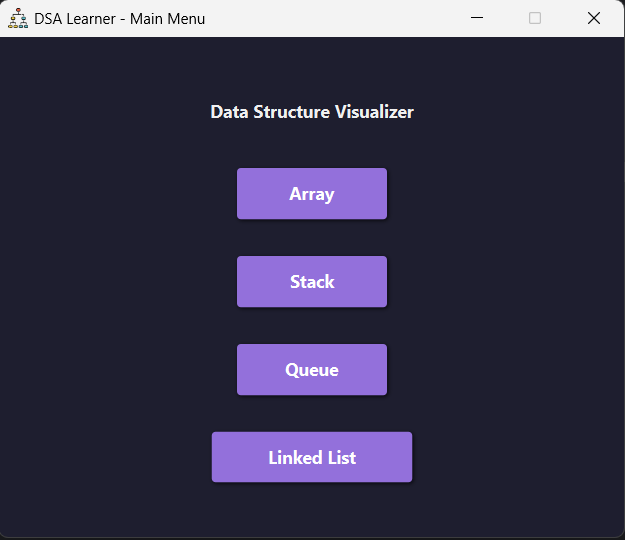

# 📘 DSA Learner Application (JavaFX)

A **JavaFX-based Data Structure Visualizer** designed to help learners understand core DSA concepts through **interactive and real-time visualizations**.

This project focuses on clarity, simplicity, and hands-on learning for:
- Arrays
- Stacks
- Queues
- Linked Lists

---

## 🚀 Features

- 🔄 **Real-time Visualization** – Watch how data moves and changes within structures
- 🧩 **Interactive Controls** – Perform operations step by step
- 🎨 **Modern UI** – Built using JavaFX and styled with CSS

---

## 🧠 Supported Data Structures

- **Arrays**
  - Index-based access
  - Sequential traversal

- **Stacks**
  - LIFO operations (Push / Pop)

- **Queues**
  - FIFO logic visualization

- **Linked Lists**
  - Node creation and pointer manipulation

---

## 📂 Project Structure

```text
DSA-Learner-Application
│
├── src
│   └── application
│       ├── Main.java
│       ├── Array.java
│       ├── Stack.java
│       ├── Queue.java
│       ├── LinkedList.java
│       ├── ArrayWindow.java
│       ├── StackWindow.java
│       ├── QueueWindow.java
│       ├── LinkedListWindow.java
│       ├── ArrayController.java
│       ├── StackController.java
│       ├── QueueController.java
│       ├── LinkedListController.java
│       ├── icons
│       └── application1.css
│
├── module-info.java
└── README.md
```

**Installation & Setup**
Prerequisites:

Java JDK 21 or higher installed.

JavaFX SDK Configurations in module file:

- javafx.controls.jar
- javafx.graphics.jar
- javafx.fxml.jar
- javafx.base.jar

**Code(module-info.java)**
```
module project {
    requires javafx.controls;
    requires javafx.fxml;
    requires javafx.graphics;
    requires javafx.base; 
    requires java.desktop; 

    opens application to javafx.fxml; 
    exports application;
}
```

Clone the Repository:
```
git clone https://github.com/Siddharth3271/DsaLearner.git
```

**Further Enhancements**
- Tree and Graph Visualizations
- Detailed Notes for each data structure

**Application ScreenShots**



